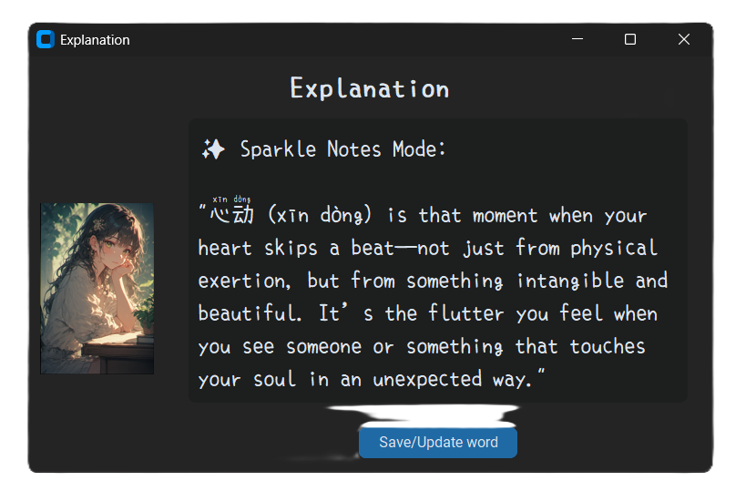

<!--  -->
<h1 align="center">
    <!--  -->
    Secretary Lulu
    <!--   -->
</h1>

> 

> 
> Stop looking up words. Start living them.
In the flow of reading or browsing, every unfamiliar word is an opportunity lost to the friction of switching tabs. Sec. Lulu - an AI language learning assistant - hopes to bridge that gap by **recording new words as you go** (clipboard or OCR), tailoring them into a **structured learning program** just for you.

Instead of static dictionary entries, you receive AI-driven insights, usage examples, and creative stories that turn abstract characters into memorable concepts.

The setup is local, no cloud, no data collection. Just you and your language learning journey.

**Currently supporting:**

- Chinese

## Features

- Monitors clipboard for new words
- Organises word learning data into a personal profile
- *Daily "What you learned" summaries with tips, reviews and exercises (in progress*)

> 

### Modes

- **Lookup-only**: fastest, searches individual words on local dictionary
- **Simple**: fast, short,concise response from AI
- **Detailed**: immersive response from AI

**To-Do:**

- [x] **Anki-based** word review session
- [x] Home: Better "What you learned" summaries (scrollable box, update AI profile)
- [x] Improved challenge+summary  ~~(change to: mixed language maybe?)~~
- [x] Integrated lookup mode(word hover: show translation + quick def) 
- [x] ~~EasyOCR integration because Powertoys OCR messed it up sometimes~~ Powertoys OCR is enough for normal uses
- [ ] Compact design (UI)
- [ ] Clipboard state & Option to lookup immediately (UI)
- [ ] **Click - save word**
- [ ] TTS
- [ ] ~~Normal sentence + words mode~~

- [ ] More test cases for each mode for debugging
- [ ] Recall & discuss on previous words (mempalace?)
- [ ] CHENGYU study
- [ ] Renewed UI
- [ ] ~~AI flexibly blending both languages (When a volcano erupts, magma will喷出 from the volcano's口)~~

- [ ] Unintended usage: sparkle on long word/fragmented sentences...
- [ ] (integrated revision, better explanation on long-complex sentences)
- [ ] Initial clipboard data isn't sent
- [ ] **Lookup-only No direct match results are wrong (displaying idioms with respective characters for some reason)**
- [ ] Card UI
- [ ] Bunch of db.py and reviewer.py errors
- [ ] Removing None from ControlPanel breaks everything

## Tech stack

- **Python** for core logic
- **Ollama**: Qwen

## Installation guide

Please refer to the [GUIDE.md](./GUIDE.md) file

## Bugs

- Sometimes new clipboard words are not registered
- invalid command name "1804464740544\< lambda \>"
- bgerror failed to handle background error.
    Original error: invalid command name "1804464659968check_dpi_scaling"
    Error in bgerror: can't invoke "tk" command: application has been destroyed

## Credits

- Mengshen font: Copyright 2020 mengshen project with Copyright 2020 LXGW
- [Perchance](https://perchance.org/text-to-image-plugin)
